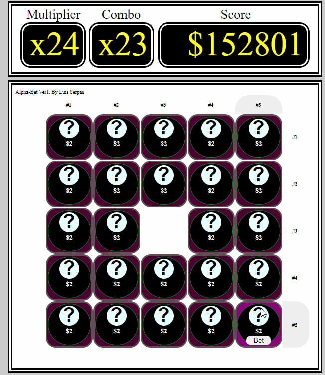

# Alpha-Bet
Bingo Themed, Web App , Created with HTML, CSS, JS, and jQuery

Version 1

Alpha Bet is a Web Application I created using html, css, and javascript.
In this version i make extensive use of the jQuery framework to create a dyanamic interface. 

Alpha-Bet is a game in which the user picks a position out of a grid of choices. 
The User guess both the location of the next chosen square and he letter that will appear there.

In Version 1. The user only has to guess the correct location.
But Different versions, or different game modes will play by different rules. 

Here is a video of the Gameplay:

...
Note the grey column highlights that automatically detect
the location of user input.

The locations of the next chosen block is chosen using the
Midpoint circle algorithm, in a grid of 5 by 5
https://en.wikipedia.org/wiki/Midpoint_circle_algorithm

